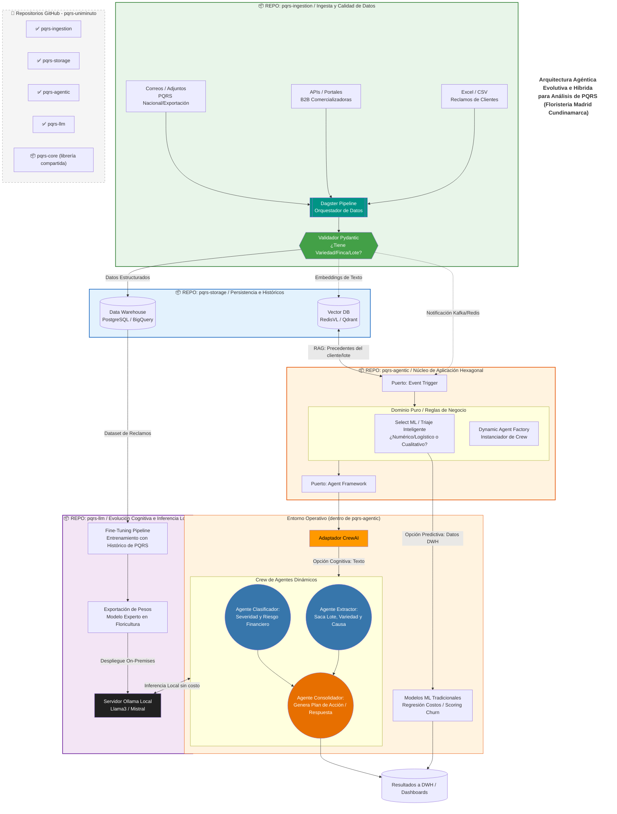

# 🌸 PQRS Uniminuto - Arquitectura Agéntica para Floristería Madrid Cundinamarca
## 👥 Equipo


| Nombre Completo | Correo Electrónico |
| --- | --- |
| **Edgardo Samuel Barraza Verdesoto** | [edgardo.barraza.v@uniminuto.edu.co](mailto:edgardo.barraza.v@uniminuto.edu.co) |
| **Ericka Alexandra Jimenez Rodriguez** | [erjimenez@uniminuto.edu](mailto:erjimenez@uniminuto.edu) |
| **José Danilo Sánchez Torres** | [jose.sanchez.t@uniminuto.edu](mailto:jose.sanchez.t@uniminuto.edu) |
| **Daniela Alejandra Segura Lazcarro** | [daniela.segura-l@uniminuto.edu.co](mailto:daniela.segura-l@uniminuto.edu.co) |

## 🎯 Propósito

Sistema inteligente para análisis y gestión de **PQRS** (Peticiones, Quejas, Reclamos y Sugerencias) del sector floricultor en Madrid, Cundinamarca.

### Problema que resuelve
- 📊 **Volumen**: Múltiples fuentes (Excel, APIs B2B, Correos)
- 🧠 **Complejidad**: Texto no estructurado + datos numéricos
- ⚡ **Velocidad**: Respuesta rápida vs análisis profundo
- 💰 **Costo**: Modelos cloud vs inferencia local

## 🏗️ Arquitectura

### Arquitectura de Componentes (PQRS Floristería)

| Componente | Repositorio | Contenido Principal | Tecnología | Escalamiento / Uso |
| :--- | :--- | :--- | :--- | :--- |
| **1: Ingesta + Validación** | `floristeria/pqrs-ingestion` | <ul><li>Dagster pipelines (jobs/schedules/sensors)</li><li>Conectores a fuentes (Excel, APIs, Email)</li><li>Validadores Pydantic (reglas de negocio)</li></ul> | Python + Dagster + Pydantic | Batch / Event-driven |
| **2: Almacenamiento** | `floristeria/pqrs-storage` | <ul><li>Esquemas DWH (PostgreSQL/BigQuery)</li><li>Configuración Vector DB (RedisVL/Qdrant)</li><li>Migraciones (Alembic)</li><li>Clientes de acceso unificados</li></ul> | SQL + Redis + Python clients | Persistencia gestionada |
| **3: Núcleo Agéntico** | `floristeria/pqrs-agentic` | <ul><li>FastAPI app (endpoints REST)</li><li>Triaje inteligente (selector ML/rules)</li><li>Modelos ML tradicionales (XGBoost, RF)</li><li>CrewAI agents (extractor, clasificador, consolidador)</li><li>Agent Factory (instanciación dinámica)</li></ul> | FastAPI + CrewAI + scikit-learn + Ollama client | Stateless, múltiples réplicas CPU |
| **4: Evolución + LLM** | `floristeria/pqrs-llm` | <ul><li>Ollama server config (docker-compose)</li><li>Fine-tuning pipelines (transformers + LoRA)</li><li>Exportación de pesos</li><li>Model registry (versiones)</li></ul> | Ollama + Python (transformers, peft) + Docker | GPU preferible, procesos offline |

---

### Componente Transversal

| Librería Compartida | Repositorio | Contenido Principal | Modo de Uso |
| :--- | :--- | :--- | :--- |
| **pqrs-core** | `floristeria/pqrs-core` | <ul><li>Contratos/eventos (Pydantic models)</li><li>Interfaces ABC (ports)</li><li>Utilidades comunes</li></ul> | `pip install floristeria-pqrs-core` <br>*(Instalada en los 4 componentes principales)* |

### Estructura general de carpetas
```

github.com/floristeria-madrid/
│
├── pqrs-core/                      # Librería base (dependencia de todos)
│   ├── floristeria_pqrs/
│   │   ├── contracts/              # Eventos canónicos
│   │   │   ├── ingestion.py
│   │   │   ├── validation.py
│   │   │   └── results.py
│   │   ├── ports/                  # Interfaces ABC
│   │   │   ├── data_source.py
│   │   │   ├── agent_strategy.py
│   │   │   └── storage_backend.py
│   │   └── utils/
│   └── pyproject.toml
│
├── pqrs-ingestion/                 # COMPONENTE 1
│   ├── dagster/
│   │   ├── jobs/
│   │   │   ├── ingest_excel.py
│   │   │   ├── ingest_apis.py
│   │   │   └── ingest_emails.py
│   │   ├── schedules.py
│   │   └── sensors.py
│   ├── connectors/
│   │   ├── excel_reader.py
│   │   ├── api_b2b_client.py
│   │   └── email_imap.py
│   ├── validators/
│   │   ├── schemas.py
│   │   └── business_rules.py
│   ├── docker-compose.yml
│   └── requirements.txt
│
├── pqrs-storage/                   # COMPONENTE 2
│   ├── dwh/
│   │   ├── migrations/             # Alembic
│   │   ├── models/
│   │   └── queries/
│   ├── vector/
│   │   ├── redis_config.py
│   │   └── embeddings.py
│   ├── clients/
│   │   ├── dwh_client.py
│   │   └── vector_client.py
│   └── docker-compose.yml
│
├── pqrs-agentic/                   # COMPONENTE 3
│   ├── api/
│   │   ├── app.py
│   │   ├── routes/
│   │   │   ├── process.py
│   │   │   └── health.py
│   │   └── dependencies.py
│   ├── triage/
│   │   ├── selector.py
│   │   ├── value_metrics.py
│   │   └── features.py
│   ├── ml_models/
│   │   ├── models/
│   │   │   ├── cost_regression.pkl
│   │   │   └── churn_classifier.pkl
│   │   └── predictors/
│   ├── crew_agents/
│   │   ├── extractor.py
│   │   ├── classifier.py
│   │   ├── consolidator.py
│   │   └── factory.py
│   ├── Dockerfile
│   └── requirements.txt
│
├── pqrs-llm/                       # COMPONENTE 4
│   ├── ollama/
│   │   ├── docker-compose.yml
│   │   └── modelfiles/
│   ├── training/
│   │   ├── fine_tune.py
│   │   ├── export_weights.py
│   │   └── data_prep.py
│   ├── registry/
│   │   └── versions.json
│   └── scripts/
│       └── deploy_model.sh
│
└── README.md                       # Documentación general
    ├── arquitectura/
    ├── despliegue/
    └── desarrolladores
```


### Conexion

```
Flujo de datos:

  pqrs-ingestion ──(Kafka/Redis)──► pqrs-agentic
       │                                  │
       │ (escribe)                         │ (consulta)
       ▼                                  ▼
  pqrs-storage ◄──────────────────────────┘
       │
       │ (lectura para training)
       ▼
  pqrs-llm

Dependencias:

  pqrs-ingestion ──► pqrs-core (librería)
  pqrs-storage   ──► pqrs-core (librería)
  pqrs-agentic   ──► pqrs-core (librería)
  pqrs-llm       ──► pqrs-core (librería)

  pqrs-agentic ──► pqrs-storage (cliente DB)
  pqrs-agentic ──► pqrs-llm (cliente Ollama)
```

### Repositorios

### Arquitectura de Componentes y Ubicación (PQRS Floristería)

| Componente | Repositorio (`📦`) | Ubicación Local Sugerida | Contenido Principal | Tecnología | Escalamiento / Uso |
| :--- | :--- | :--- | :--- | :--- | :--- |
| **1: Ingesta + Validación** | `floristeria/pqrs-ingestion` | `https://github.com/pqrs-uniminuto/pqrs-ingestion` | <ul><li>Dagster pipelines (jobs/schedules/sensors)</li><li>Conectores a fuentes (Excel, APIs, Email)</li><li>Validadores Pydantic (reglas de negocio)</li></ul> | Python + Dagster + Pydantic | Batch / Event-driven |
| **2: Almacenamiento** | `floristeria/pqrs-storage` | `https://github.com/pqrs-uniminuto/pqrs-storage` | <ul><li>Esquemas DWH (PostgreSQL/BigQuery)</li><li>Configuración Vector DB (RedisVL/Qdrant)</li><li>Migraciones (Alembic)</li><li>Clientes de acceso unificados</li></ul> | SQL + Redis + Python clients | Persistencia gestionada |
| **3: Núcleo Agéntico** | `floristeria/pqrs-agentic` | `https://github.com/pqrs-uniminuto/pqrs-agentic` | <ul><li>FastAPI app (endpoints REST)</li><li>Triaje inteligente (selector ML/rules)</li><li>Modelos ML tradicionales (XGBoost, RF)</li><li>CrewAI agents (extractor, clasificador, consolidador)</li><li>Agent Factory (instanciación dinámica)</li></ul> | FastAPI + CrewAI + scikit-learn + Ollama client | Stateless, múltiples réplicas CPU |
| **4: Evolución + LLM** | `floristeria/pqrs-llm` | `https://github.com/pqrs-uniminuto/pqrs-llm` | <ul><li>Ollama server config (docker-compose)</li><li>Fine-tuning pipelines (transformers + LoRA)</li><li>Exportación de pesos</li><li>Model registry (versiones)</li></ul> | Ollama + Python (transformers, peft) + Docker | GPU preferible, procesos offline |

### Componente Transversal

| Librería Compartida | Repositorio (`📦`) | Ubicación Local Sugerida | Contenido Principal | Modo de Uso |
| :--- | :--- | :--- | :--- | :--- |
| **pqrs-core** | `floristeria/pqrs-core` | `https://github.com/pqrs-uniminuto/pqrs-core` | <ul><li>Contratos/eventos (Pydantic models)</li><li>Interfaces ABC (ports)</li><li>Utilidades comunes</li></ul> | `pip install floristeria-pqrs-core` <br>*(Instalada en los 4 componentes principales)* |

### Diagrama

